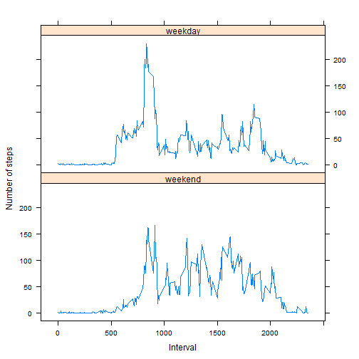

## Activity Monitoring Data Analysis Assignment

This data analysis assignment makes use of data from a personal activity monitoring device, processes the data and generates some summaries. The monitoring device collects data at 5 minute intervals through out the day. The data consists of two months of data from an anonymous individual collected during the months of October and November, 2012 and include the number of steps taken in 5 minute intervals each day.

The data set used for this assignment is [Activity Monitoring Data](https://d396qusza40orc.cloudfront.net/repdata%2Fdata%2Factivity.zip)


The variables included in this dataset are:
  
  1. steps: Number of steps taking in a 5-minute interval (missing values are coded as NA)
  
  2. date: The date on which the measurement was taken in YYYY-MM-DD format
  
  3. interval: Identifier for the 5-minute interval in which measurement was taken

The dataset is stored in a comma-separated-value (CSV) file and there are a total of 17,568 observations in this dataset.

### Loading and pre processing the data

The data is read from the acivity.csv file and stored in a data frame for further use


```r
setwd("~/Coursera/Reproducible Research/PA1")
activityData <- read.csv("activity.csv")
```

### Calculating the mean total number of steps per day
All rows with NA's are removed from the data set inorder to calculate the mean.

The total number of steps per day is calculated using the aggregate function.

A histogram for the total steps per day is generated using the hist function.

The mean and median for the total steps per day is calculated using the mean and median functions. The mean is 10766.19 and the median is 10765.


```r
activityDataNoNA <- na.omit(activityData)
activityDateSummary <- aggregate(steps ~ date, data=activityDataNoNA, FUN=sum)
hist(activityDateSummary$steps, main="Histogram for Total Steps per Day collected during Oct and Nov 2012",xlab = "Total Steps per Day", breaks = 5,col="blue")
```

 

```r
mean(activityDateSummary$steps)
```

```
## [1] 10766.19
```

```r
median(activityDateSummary$steps)
```

```
## [1] 10765
```

### Analyzing Average Daily Activity Pattern
All rows with NA's are removed from the data set.

A time series plot has been plotted with the interval on the x-axis and the average number of steps taken, averaged across all days (y-axis)

The 5-minute interval containing the maximum number of steps averaged across all days is calculated and this is 835.  


```r
activityIntSummary <- aggregate(steps ~ interval, data=activityDataNoNA, FUN=mean)
plot(steps ~ interval, activityIntSummary, type = "l", main = "Average Daily Activity Pattern", xlab="Interval",ylab = "Steps")
```

 

```r
activityIntSummary[activityIntSummary$steps==max(activityIntSummary$steps),]$interval  
```

```
## [1] 835
```

### Inputting missing values
The total number of rows with NA in the data set is calculated and printed. There are 2304 rows with NA's.

The NA values are substituted with the mean for that particular interval. The data set generated in the previous section is used to fill the missing values.

A new data set with the filled in values has been created. 

A histogram for the total steps per day for the new data set is generated using the hist function.

The mean and median for the total steps per day is calculated using the mean and median functions. The mean and median are both 10766.19. Subsituting the values in this scenario has not changed the value for the mean and the change to the median value is not significant.


```r
rowswithna <- nrow(activityData[is.na(activityData$steps)==TRUE,,])

print(rowswithna)
```

```
## [1] 2304
```

```r
activityDataSubs <- activityData[is.na(activityData$steps)==TRUE,,]
rsum <- nrow(activityIntSummary)
for (i in 1:rowswithna){
   for (j in 1:rsum) {
     if (activityDataSubs$interval[i] == activityIntSummary$interval[j])
     {
  activityDataSubs$steps[i] <- activityIntSummary$steps[j]
      }
    }
}

activityDataTotal <- rbind(activityDataNoNA,activityDataSubs)
activityDateTotalSummary <- aggregate(steps ~ date, data=activityDataTotal, FUN=sum)
hist(activityDateTotalSummary$steps, main="Histogram for Total Steps(with NAs) per Day collected during Oct and Nov 2012",xlab = "Total Steps per Day", breaks = 5,col="blue")
```

 

```r
mean(activityDateTotalSummary$steps)
```

```
## [1] 10766.19
```

```r
median(activityDateTotalSummary$steps)
```

```
## [1] 10766.19
```

### Differences in activity patterns between weekend and weekdays

A new factor variable in the dataset with two levels - "weekday" and "weekend" indicating whether a given date is a weekday or weekend day has been added to the new data set

A panel plot containing a time series plot of the 5-minute interval (x-axis) and the average number of steps taken, averaged across all weekday days or weekend days (y-axis) has been generated


```r
wkdays <- c('Monday', 'Tuesday', 'Wednesday', 'Thursday', 'Friday')
activityDataTotalwithFactor <- cbind(activityDataTotal,factor((weekdays(as.Date(activityDataTotal$date)) %in% wkdays), levels=c(FALSE, TRUE), labels=c('weekend', 'weekday')))
names(activityDataTotalwithFactor)[4] <- "Factor"
activityFactorSummary <- aggregate(steps ~ interval + Factor, data=activityDataTotalwithFactor, FUN=mean)

library("lattice")
 xyplot(steps ~ interval|Factor, 
        data = activityFactorSummary,
        type = "l",
        xlab = "Interval",
        ylab = "Number of steps",
       layout=c(1,2))
```

 
